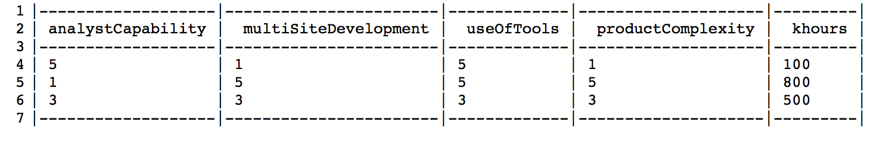

# Answers to Lecture Review Questions

## Review 1
#### What is the Waterfall model?
It suggests a sequential approach to software development that begins with customer specification of requirements and progresses through planning , modeling, constructing, and deployment, culminating in ongoing support of the completed software.

#### What are the properties of the Waterfall model?
- The project consists of sequential, non-overlapping phases, where a phase cannot begin until the previous phase is completed.
- At the end of every phase, there is a gate where a decision is made to allow the project to move forward or not.
- Changes are controlled. Major changes are only allowed if Change Control Board approves them.
- The product is ony finished a the end of the last phase.
- Once the project is done, the product/service enteres into a maintenance phase.
- Low overhead of the methodology compared to other models such as Agile.
- siloed, serial, slow

#### What are the different steps of the Waterfall model?

#### Define Unit testing
Unit testing is a software development process in which the smallest testable parts of an application, called units, are individually scrutinized for proper operation. 

#### Define System testing
System testing is testing conducted on a complete, integrated system to evaluate the system's compliance with its specified requirements. It falls in the scope of black-box testing, and requires no knowledge of the inner design. The purpose is to detect any inconsistencies between units.

#### What are the 4 parts of V-diagram? For each part, how much time do you expect to spend in each?
1/3 planning (requirements, design); 1/6 coding; 1/4 unit test (testing code written by one programmer); 1/4 system test (testing code assemblies built by multiple programmers).

#### What are the parts of a 3-tier architecture? Given the middle part(model) as N, how much lines of code is the total?
The 3-tier architecture is a client-server architecture in which presentation(user interface), application processing(functional process logic), and data management funcitons are physically separated. It provides a model by which developers can create flexible and reusable applications.
The rule of thumb is that each business object needs
- about 1 class to do the connect and translation to the DB
- about 1 class to do the connection and interaction with the GUI
- about half a class of "helper" utilities
 
so 2.5 classes + the original = 3.5 N

#### What is dialog independence?
The decoupling of the Computer-Human Interface from the core application software.
the separation of dialogue definition from dialogue execution

#### What is data independence? Name a tool that supports data independence.
- The separation of data from the applications that use the data. DBMS implement data independence that hides the detail of the physical data storage structure from user application, and with logical data independence, gives the feature of data abstraction.
- It refers to the immunity of user applications to changes made in the definition and organization of data. Each higher level of the data architecture is immune to changes of the next lower level of the architecture. 

#### What is Brook's law?
It is a claim about software project management that "adding manpower to a late software project makes it later." 

#### Explain why adding more people to a late project does not help.
- It takes some time for the people added to become productive. (Ramp up time)
- Communication overheads increase as the number of people increases.
- Limited divisibility of tasks.

#### What are Brook's rules of thumb for software development costs?
1/3 planning (requirements, design); 1/6 coding; 1/4 unit test (testing code written by one programmer); 1/4 system test (testing code assemblies built by multiple programmers).

#### What is Royce's critique of the Waterfall model? What is his preferred solution?
Critique: 
- Unfortunately, design iterations are never confined to the sucessive steps.
- Later tests can lead to changes to document very much upstream.

Solution: More documentation
- Write an overview document that is understandable, informative and current. Each and every worker mush have an elemental understanding of the system. At least one person must have a deep understanding of the system which comes partially from having had to write an overview document.

#### List and define three common practices of Agile/XP
Planning:
- Release planning creates the release schedule.
- Make frequent small releases.
- The project is divided into iterations.
- Iteration planning starts each iteration.

Coding:
- The customer is always available.
- Code ust be written to agreed standards.
- Code the unit test first.
- All production code is pair programmed.
- Only one pair integrated code at a time. 
- Set up a dedicated integration computer.
- Use collective ownership.

Testing:
- All code must have unit tests. 
- All code must pass all unit tests before it can be released.
- When a bug is found, tests are created.
- Acceptance tests are run often and the score is published. 

#### What are the advantages of Agile method over other processes?
- Customer satisfaction by rapid, continuous delivery of useful software.
- People and interactions are emphasized rather than process and tools. Customers, developers and testers constantly interact with each other.
- Working software is delivered frequently.
- Face-to-face conversation is a productive form of communication.
- Close, daily cooperation between business people and developers.
- Continuous attention to technical details and good desgin.
- Regular adaption to ching circumstances.
- Even late changes in requirements are welcomed.

#### What are the shortcomings of Agile method?
- In case of some software deliverables, especially the large ones, it is difficult to assess the effort required at the beginning of the software development life cycle.
- There is lack of emphasis on necessary designing and documentation.
- The project can easily get taken off track if the customer representative is not clear what final outcome that they want.
- Only senior programmers are capable of taking the kind of decisions required during the development process. Hence, it can be harder for newbies to be agile, unless combined with experienced resources.

#### For what kind of project would you use Agile? Explain
Flexible product development with constant update.
- constantly adding new features
- feedback driven
- limited time and resources for planning at the beginning
- important decisions have to be made after the initiation of the project

#### For what kind of project would you use Waterfall? Explain
- Highly structured projects in which after-the-fact changes are prohibitively costly, if not impossible 
- Lots of interim steps, great for funding large projects, defining cash flows even before any code is running

#### What are the activities involved in DevOps?

## Review 2
### Theory:
#### Why might, in theory, software development effort grow exponentially with size (LOC)?
Software is complex and has lots of bugs. A software system with N modules has $N^2$ possible intraconnections, each of which must be designed and built and tested and maintained. 
- state space grows exponentially to the number of variables; Intraconnection between different modules grows quadratically.

#### In practice, software effort does not grow exponentially with size (LOC). Give 2 reasons why this might be so.
High-quality flexible and reusable codes. Powerful and smart software development tools. Mature testing strategies.
- Usage biased the same way as the construction of SE; follow good practices; Reuse of code and modules; Architectures;

### C, Go, C++:
#### C++ and Go are variations of which language?
C

#### List the order of creation for C, C++ and Go.
C -> C++ -> Go

#### List one innovation in C++ over C. In two lines, explain the SE implications of that innovation.
C++ can use classes to provide extensible types and package data and its related behaviors as methods. This abstract design can promote code reusability in future development.

#### List one innovation in Go over C++. In two lines, explain the SE implications of that innovation.
Concurrency, garbage collection, interface types, reflection, type switches. Because of garbage collection, it makes interfaces easier to specify, and also make concurrency more automatic without worry about the ownerships of memory piece, which save lots of programming effort in memory allocation and freeing.

#### What is the technical role of the header file in C?
To declare functions, macros and variables that are available. 
C function declarations and macro definitions to be shared between several source files.

#### What is the process role of the header file?
- To ensure that all developers use the same version of data layout definition or procedural code throughout the project.
- Easily cross-reference where components are used in a system.
- Easily change programs when needed. 
- Save time by not needing to code extensive data layouts.

#### Give a specific project that would use C? List two reasons, justify each.
Develop an OS for wearable device. Performance, efficiency and maintanence. Programming in robotics; robots are controlled in real time, C is fast; Controlling robots requires programing with hardware, pointer and register operation in C is convenient;

#### Give a specific project that would best not use C? List two reasons, justify each.
Interactive data analysis. Not support cross-platform once compiled. Not able to run without compilation, lack of interaction.
Web application; portability, security and maintenance.

### Coffee Script and JavaScript:
#### How CoffeeScript is better than JavaScript?
Better readability by simpler syntax. No more polluting global namespaces.
Less verbose

#### Why not to use CoffeeScript instead of JavaScript?
Mixture of CS and JS.
Steep learning curve; less support

#### How is CoffeeScript implemented?
The code compiles one-to-one into the equivalent JS code, and there is no interpretation at runtime.
Trans compile to JavaScript

## Review 3
### Typed languages:
#### Briefly explain compile-time type inference concept of programming languages. Give an example.
It refers to the automatic deduction of the data type of an expression at the compile time. It limit the values a particular exprssion can take on at run-time.
Number -> float or int for operator '+';  modulus % integer

#### How might compile time type inference reduce error rates in SE?
Reduce the mismatch between data type and data value. Automatically select the data type according to the operations.

### Architectures:
#### Define "software architecture"? Give three examples.
It refers to the high level structures of a software system, the discipline of creating such structures, and the documentation of these structures. It is about making fundamental structural decisions that are costly to change once implemented. It is also the space within which we can conduct massive experimentation.

#### Project1 has good architecture and project2 has bad architecture. What might we observe in one of those projects and not in the other?
- Reasonable logic structure, 
- complete and readable documentation. 
- Layered structure for divisibility.

### Architectures: Case studies:
#### What is the net-neutrality rule in a packet switching network architecture?
It is the principle that internet service providers should treat all data packets in the network the same, without discrimation by the user, platform, application and so on.

#### What advantage does the distributed network has over centralized network?
Each site is self-sustained, thus more independent and easier for incremental update. Less reliable on single node, more secure. Higher availability of services.

#### Blackboards: What are the properties of Backboard architecture? State an application where the Blackboard architecture can be used and justify? Some say that "publish-subscribe" might be useful for blackboard. What is Publish-Subscribe and how might it be useful for blackboards?
Blackboard:
- Blackboard: a structured global memory containing objects from the solution space.
- Knowledge sources: highly specialized modules with their own representation
- Control components: selects, configures and execute knowledge sources.

- Global database called blackboard; 
- logically independent sources of knowledge called knowledge source. 
- knowledge source respond to changes on blackboard; There’s no control flow and knowledge source are self-activating.

Online forum as application; computer vision;

Publish-Subscribe is a messaging pattern where publishers don't program the messages to be sent directly to specific receivers, but instead characterize the messages into classes without knowledge of subscribers. And similarly, subscribers express their interest in classes and only receive messages of their interest without knowledge of the publishers.

Publishers and subscribers could build the knowledge sources of their common interests, and the message matching mechanism can serve as the blackboard and control components.

####Layered system.s: What are layered systems? Give an example of a layered system architecture and list its layers? State two advantages of layered architecture and explain them? State two disadvantages of layered architecture and explain them? What limitations does the LAMP architecture has? How does MEAN try to solve them?
Partitions the concerns of the application into stacked groups

Use layers for allocating the different concerns and responsibilities of a system:
- Presentation layer
- Application layer
- Business layer
- Data access layer

Advantages:
1. Abstraction. Abstract the view of the system. 
2. Reusable. No dependences on higher layers.

	Abstraction;
	Encapsulation;
	Clearly defined functional layers;
	High cohesion;
	Loose coupling;
	Separation of concerns;
	Event-based notification;
	Delegated event handling;

Disadvantage:
1. Need clearly define layer functions. 
2. No knowledge of detail of other layers. Hard to modify.

	More communication between layers;
	Adds complexity to a simple project;
	
LAMP: 
- MySQL is a relational database
- Different programming languages between layers. Hard to rewrite codes.
- Linux platform dependent

MEAN:
- MongoDB is NoSQL and document-oriented database.
- All implemented in Javascript and support cross-platform
- Easier to work on both server and client sides.

Difficult to integrate; MEAN one language up and down the stack (javascript) so (1) faster integrated testing; and (2) faster invention of new patterns.

#### MVC: Define MVC? Give an example of the MVC architecture. List the componenets and their roles.
Model-View-Controller. It isolates the application logic from the user interface layer and separates the concerns.
- Model: directly manages the data, logic and rules of the application.
- View: Display the representations of information to users.
- Controller: controls the interaction between model and view.
A file explorer;  Model, tree structured directories; View, window containing current directories; Controller, make/delete directories;

#### Pipe & filter: What problem did the pipe & filter architecture tackle upon its creation? Why pipe&filter architecture is linear? What are the properties of pipe&filter architecture? Give an example that uses pipe and filter architecture? What are the advantages of pipe&filter architecture? What are some of the disadvantages?
Processing the output of one program as the input of another.
Properties:
- Each program only does one little task.
- Linear and one-directional.
- Make every program a filter.

Write programs that do one thing and do it well.
UNIX has hundreds of domain specific-languages, each doing one little task.
e.g. ls, cp, rm, and (see below) bash, make.
Write programs to work together.
Write programs to handle text streams, because that is a universal interface.
Small is beautiful.
Build a prototype as soon as possible.
Choose portability over efficiency.
Use shell scripts to increase leverage and portability.
Avoid captive user interfaces.
Make every program a filter.
Read a file of text, determine the n most frequently used words, and print out a sorted list of those words along with their frequencies.
tr -cs A-Za-z '\n' | tr A-Z a-z | sort | uniq -c | sort -rn | sed ${1}q

Advantage:
- Filters stand alone and can be treated as black boxes.
- Simiplicity and low coupling.
- Late binding. Construction of pipe and filter sequence can often be delayed until runtime.
- Parallel or multitasking.

* Filters stand alone and can be treated as black boxes. This isolation of functionality helps to ensure quality attributes such as information hiding, high cohesion, modifiability, and reuse.
* Filters interact with other components in limited ways. This connection simplicity helps to ensure low coupling. Pipes and filters can be hierarchically composed. Higher order filters can be created from any combination of lower order pipes and filters.
* The construction of the pipe and filter sequence can often be delayed until runtime (late binding). This permits a controller component to tailor a process based on the current state of the application.
* Because the process performed by the filter is isolated from the other components in the system, it is relatively easy to run a pipe-and-filter system on parallel processors or in multiple threads on a single processor. parallelism

Disadvantage:
- Sequential order, less interactive.
- High overhead of parsing and unparsing high-level information tokens.
- Possible unlimited buffer size and system deadlock.

* Because the problem is decomposed into sequential steps, a batch mentality is encouraged. It is difficult to create entire interactive applications using this style.
* Filters often force the data to be represented in the lowest common denominator, typically byte or character streams. This means that if processing must be based on information tokens (words, lines, records), every filter may introduce overhead for parsing and unparsing the data stream.
* If a filter can not produce any output until it has received all of its input, the filter will require a buffer of unlimited size. If fixed size buffers are used, the system could deadlock. A sort filter has this problem.

#### CRUD: What is CRUD(SCRUD) concept? Where is it used?
search, create, read, update, delete.
Used in databases, distributed database services, restful interface, and persistent storage.

#### Below are two system designs, one hides the internal details of modules and the other doesn't Which one do you prefer? Explain.

The first one. It is easier to understand the general idea.

### Java:
#### What is the java virtual machine and why is it so important?
JVM is an abstract computing machine creating a platform-independent execution environment that converts Java bytecode into machine language and execute it.
To support multi-platform portability of Java programs.

### Prolog, Erlang, Elixir:
#### Compare the scoping rules of standard languages that support nested blocks and clause-based languages like Prolog.
- nested block: local inside the whole block, global inside the whole program
- clause-based: only in the very clause, no  global.

#### Who created Erlang? What problem did Erlang solve? How does the scoping rules of Erlang clauses simplify concurrency?
Ericsson Computer Science Lab. It is designed with aim of improving development of telephony applications and for developing robust systems of programs that can be distributed among different computers in a network. Processes communicate using message passing instead of shared variables, which removes the need of explicit locks

#### What are the notable features of Erlang? List three, for each write down or explain where it might be used and the implications of that usage for software engineering?
Concurrent, garbage-collected, dynamic typing, hot swapping, fault-tolerant.

#### What is Elixir? How is it implemented?
A dynamic, functional language designed for building scalable and maintainable applications. It leverages the Erlang VM, for running low-latency, distributed and fault-tolerent system.

## Review 4
### Functional Programming:
#### What is currying in functional programming? Give an example and explain.
Currying is when you break down a function that takes multiple arguments into a series of functions that take part of arguments. 
* Calling a function with less than the required arguments. Currying is when you break down a function that takes multiple arguments into a series of functions that take part of arguments.
Returns a specialized function 
Eg: add and increase. increase is curried by specifying one argument as 1;
* the technique of translating the evaluation of a function that takes multiple arguments (or a tuple of arguments) into evaluating a sequence of functions, each with a single argument.

### SQL and NoSQL:
#### What particular purpose SQL is optimized for ? Give three ways that SQL has this optimization.
Mantainabilty and Managing data in relational database system. 
- Relational constraints
- Database normalization
- Data integrity
Maintainability of well structured data; 
- SQL supports layered architectures that separate data and model, thus allowing developers to reorganize the data storage layer without messing up the business logic. 
- SQL simplifies scripts by removing nested access paths. 
- SQL removes a set of standard anomalies with long term storage (insert, delete, update anomalies)

#### State three differences betweenn SQL and NoSQL?
- tables vs documents
- schema vs schemaless
- normalization vs denormalization

#### What is database normalization? How SQL implements normalization? Give an example.
The process of efficiently organizing data in the database, by eliminating redundant data and ensuring data dependencies make sense.
- First normal form: define data items required, place related data item in a table; ensure no repeating groups of data; ensure existence of a primary key.
- Second normal form: no partial dependencies of any of the columns on the primary key.
- Third normal form: all nonprimary fields are dependent on the primary key.

process of organizing the columns (attributes) and tables (relations) of a relational database to minimize data redundancy.
Normalization involves decomposing a table into less redundant (and smaller) tables without losing information; defining foreign keys in the old table referencing the primary keys of the new ones. The objective is to isolate data so that additions, deletions, and modifications of an attribute can be made in just one table and then propagated through the rest of the database using the defined foreign keys.

#### What are the advantages and disadvantages of normalizaiton?
Advantage:
- Reduce data redundancy 
- Less update anormalies
- Group data logically
- Smaller tables for faster maintainance
- Join tables as needed (more flexible)
(1)To free the collection of relations from undesirable insertion, update and deletion dependencies; avoid anomalies;
(2)To reduce the need for restructuring the collection of relations, as new types of data are introduced, and thus increase the lifespan of application programs;
(3)To make the relational model more informative to users;
(4)To make the collection of relations neutral to the query statistics, where these statistics are liable to change as time goes by.

Disadvantage:
- Slow performance with complex relational join
- Data model difficult to query
- Require detailed analysis and complex design

#### Explain how SQL maintains layered architecture?
user/application layer, logic layer, physical layer.
SQL supports a layered architecture where all concerns about data storage, indexing, backing up, etc are handled in a database layer which applications talk to via a higher level SQL.

#### List and explain three drawbacks of SQL. How does NoSQL solves these drawbacks?
- Personnel cost: Require less management with features like automatic repair, easier data distribution, and simpler data models.
- Server cost: Typically use clusters of cheap commodity servers to manage exploding data and transaction volumes.
- Speed: Designed to expand transparently and horizontally to take advantage of new nodes with low-cost hardware.
- Quantity: No limits on data volumes
- Flexibility: Insert data without defining a rigid database schema.

#### What is NoSQL optimized for?
Flexibility and scalability.

#### What kind of applications should use NoSQL? Give an example and explain.
Large data size with various and flexible data format

#### What kind of application should not use NoSQL? 
Highly structured static data of high maintenance cost.

### Data anomalies:

1. Unable to add new parts to inventory without new orders.
2. Unable to access the parts if the related shipment entry is deleted.
3. Unable to update part properties once it was sold, which may lead to reference error.

### ELM and JavaScript:

1. JS: event handler and callback; ELM: Signals
2. MVC (please explain)

## Review 5
### Test Driven Development:
#### State and explain the phases of test driven development cycle?
1. Add a test(RED): each new feature begins with writing a test based on the understanding the feature's specification and requirements.
2. Run all tests and see if the new one fails(RED): validate the test harness is working correctly.
3. Write some code (GREEN): to pass the test
4. Run tests(GREEN): check pass or adjust otherwise
5. Refractor code: clean up growing code regularly.

#### What are the advantages and disadvantages of Test Driven Development? List and explain three.
Advantage:
- Offer more than just simple validation of correctness, but can also drive the design of a program.
- offer the ability to take small steps when required.
- Total code implementation time could be actually shorter.
- Lead to more modularized, flexible, and extensible code.

- Avoid over-engineering. I have a tendency to "throw in" functionality I "know" I'm "going to need". Making one red test green (along - with the list of future tests) helps me implement just enough. I need to find a new way to stay focused.
- API feedback. Get quick feedback about my API decisions.
- Logic errors. Catches pesky errors.
- Documentation. Communicate how I expect APIs to be used and to record what I was thinking during development.
- Never feel overwhelmed. With TDD, even if I couldn't imagine an implementation I could almost always figure out how to write a test (finding the next "step up the mountain"). Drive the design of a program.
- Separate interface from implementation thinking. I have a tendency to pollute API design decisions with implementation speculation. - TDD separates the two levels of thinking while still providing rapid feedback between them.
- Agreement. A way to be precise with a programming partner about what problem I'm solving.
- Less anxiety. TDD gives me an instantaneous "Is Everything Okay?" button.

Disadvantage:
- Unit tests are smalll while function tests are much larger. 
- Many tests may be uninformative.

- Notes that unit tests are very small while function tests (aka system tests) are much larger, much more complex. Much slower to run, not the kind of thing to give you instant feedback.

"Tests should be designed with great care. Business people, rather than programmers, should design most functional tests. Unit tests should be limited to those that can be held up against some “third-party” success criteria."
"If you have a large unit test mass, evaluate the feedback loops in your development process. Integrate code more frequently; reduce the build and integration times; cut the unit tests and go more for integration testing. "

#### A company shows you their new very fast edit/compile/run tool for some language. They claim that the language will significantly reduce software development time. Based on the theory presented in this class, would you doubt that claim. Justify.

#### What are the heuristics for not testing all the time?
Evaluate the feedback loops in your development process. Integrate code more frequentyly. Reduce the build and integration times. Cut the unit tests and go more for integration testing.

Most tests are uninformative (less that 1% fail)
So now they track the effectiveness of each test (i.e. how many bugs they found in the past) And they run, at higher frequency, those "informative" tests.

#### What is a mock in Test Driven Development? What purpose does it serve?
A mock is a stand-in for a real module. It doesn’t contain any real functionality but rather imitates a module’s interface. When used in a test, a mock intercepts calls between the module under test and the mocked module. If the function being called has a return value, the mock for that function will also return a value as specified in the test. A programmer typically creates a mock object to test the behavior of some other object, in much the same way that a car designer uses a crash test dummy to simulate the dynamic behavior of a human in vehicle impacts.

### Refractoring:
#### What is YAGNI?
You aint gonna need it.

#### What is the rule of three for refractoring?
Rule of three is a code refactoring rule of thumb to decide when a replicated piece of code should be replaced by a new procedure. It states that the code can be copied once, but that when the same code is used three times, it should be extracted into a new procedure.

## Review 6
### Design patterns:
#### What is the Composite pattern? Give an example and explain its components.
The composite pattern is a partitioning design pattern. The composite pattern describes that a group of objects is to be treated in the same way as a single instance of an object. The intent of a composite is to "compose" objects into tree structures to represent part-whole hierarchies. Implementing the composite pattern lets clients treat individual objects and compositions uniformly.
e.g. Although the example is abstract, arithmetic expressions are Composites. An arithmetic expression consists of an operand, an operator (+ - * /), and another operand. The operand can be a number, or another arithmetic expresssion. Thus, 2 + 3 and (2 + 3) + (4 * 6) are both valid expressions.

#### What is the cascade-delete policy? How can it be applied to editing directories in file system.s and data in SQL?
Whenever rows in the master (referenced) table are deleted (or updated), the respective rows of the child (referencing) table with a matching foreign key column will be deleted (or updated) as well. This is called a cascade delete (or update).

#### What is the Proxy design pattern? Give an example and explain its components.
A class functioning as an interface to something else. In short, a proxy is a wrapper or agent object that is being called by the client to access the real serving object behind the scenes. For the client, usage of a proxy object is similar to using the real object, because both implement the same interface.

#### How does Proxy handle DRY?
Provide accesses to the repeated function with the function defined only once.

#### What is Singleton design pattern? Give an example and explain its components.
Ensure a class only has one instance and provide a global point of access to it.

### What is the underlying design patterns common in the following browsing systems? Explain.

Composite browser.

#### What is DRY? What problem is anti-DRY in layered architecture? 
Don't Repeat Yourself. Layers are not really separated, so much interaction.

#### What is the Visitor pattern? Give an example and explain its components.
It is a way of separating an algorithm from an object structure on which it operates. A practical result of this separation is the ability to add new operations to existing object structures without modifying those structures.
- Represent an operation to be performed on the elements of an object structure. Visitor lets you define a new operation without changing the classes of the elements on which it operates.
- Visitor implements "double dispatch". OO messages routinely manifest "single dispatch" - the operation that is executed depends on: the name of the request, and the type of the receiver. In "double dispatch", the operation executed depends on: the name of the request, and the type of TWO receivers (the type of the Visitor and the type of the element it visits).

#### How can polymorphism solve the problem of OO abuse bad smell in switch statements?
Relatively rare use of switch and case operators is one of the hallmarks of object-oriented code. Often code for a single switch can be scattered in different places in the program. When a new condition is added, you have to find all the switch code and modify it. As a rule of thumb, when you see switch you should think of polymorphism. Create subclasses matching the branches of the conditional. In them, create a shared method and move code from the corresponding branch of the conditional to it. Then replace the conditional with the relevant method call. The result is that the proper implementation will be attained via polymorphism depending on the object class.

### Arthur Riel's OO Design Heuristics:

### Anti-patterns:
#### What are anti-patterns. List three.
A common response to a recurring problem that is usually ineffective and risks being highly counterproductive.

#### For each of the anti-patterns below give three examples:
- [ ] Bloated: Long method; Large class; Long parameter list. Data clumps.
- [ ] OO-abusers:  Switch statements; Temporary field; Alternative classes with different interfaces.
- [ ] Dispensables: Duplicate code; Lazy class; Dead code.

## Review 7
### Lazy Evaluation & goto:

Because traditional language will actively evaluate the arguments, in this case write(), so that both False and True will be printed before unless is evaluated.
Lazy evaluation solve this by no evaluation of the arguments until the final implementation of the unless() function.

#### Why is goto considered harmful? Give an example and explain.
- Too many goto can mess up the code readability.
- If the workflow is one-directional, goto can make it backward, which twists the logic.
- Goto can jump out of the code block without proper judgement of conditions, which lead to errors.

#### Give an example where goto can be useful?
- To make the code more readable and easier to follow
- To make smaller programs, and get rid of code duplication
- For implementing multi-level break and continue if not directly supported in the language
- Transitions in finite-state machines 

### Closures:
#### What is a closure? How is a closure created?
Closures (also lexical closures or function closures) are a technique for implementing lexically scoped name binding in languages with first-class functions. Operationally, a closure is a record storing a function[a] together with an environment: a mapping associating each free variable of the function (variables that are used locally, but defined in an enclosing scope) with the value or storage location to which the name was bound when the closure was created.

A closure is created when:
- The scope of some inner function refers to an outer scope's variables.
- The inner function is passed around as a varable, carrying with it the inner scope and the outer scope.

#### How can closures be applied? Give an example and explain.
Parallelism: Enter closures. Bundle all needed into closures, call functions, each running on its own thread.
Package, objects, classes.
Data - Model - Dialog

#### There are many ways to create a closure. Describe one of those ways.
Closures generated by model objects and cached in dialog layer.

#### In the following code snippet, the last line of output is wrong. What should it generate? Explain exactly why it generates that output? 

output is 1. 

#### What features of OO programming are demonstrated by the above example? What features are missing from the above?
Feature demonstated: Class and Objects; Encapsulation.
Feature missing: Inheritance; Polymorphism.

## Review 8
### Effort Estimation:
#### What is the Delphi (expert) method of software effort estimation? When would you want to estimate using Delphi method?
Use human expertise (possibly augmented with process guidelines, checklists, and data) to generate predictions.
When I have human expertise in my team.

#### What is the algorithmic (model based) method of software effort estimation? When would you want to estimate using algorithmic method?
build models via data mining or via expert intuition then make use those models to make predictions about new projects e.g. data mining.

good for finding the uncertainty in an estimate.  so when I want to know the uncertainty of the extimation.

#### What is overestimation and underestimation? What are their effects on development? 
When people overestimate, the feature will still get done, just at the expense of wasted time. When people underestimate, it's possible that the feature will never get done.

#### State two problems with effort estimation and explain them.
 - Problem1: Uncertainty
  - We don't know how hard it will be to build software, until we build it.
 - Problem2: Better,Faster,Cheaper (pick any two)
  - Estimation is a multi-goal optimization problem
 - Problem #3: Relucatance to Learn from Experience
  - many commercial software engineers generalize from their first few projects to all future projects 2.
  - commercial estimation “gurus” rarely use lessons from past projects to improve their future estimates
 
 

#### State three strategies, tacts, methods to solve the problems with effort estimation.
- Strategies:
  - Feature maturity : don't estimate software, reward delivery.
  - Big bang : estimate at the start to allocate resources
  - Spiral : project plan includes "stop! its not working!" points
  - Many bangs : continuous small estimation (e.g. local stories, active learning)
  - Lie : invent some nonsense number to make your manager happy
  - Don't estimate : the #noestiamtion camp. But really they do estimate (but more with many bangs and not just Big Bang).

- Tactics (so many; here's a sample):
  - Parametric : fit to an pre-guest distribution; e.g. COCOMO
  - Case-Based Reasoning : new estimates are variations of old (but similar examples)
  - Planning poker : Don't estimate, just rank work most to least expensive
  - Ensemble : Multiple estimates, combined (e.g. top-down, bottom-up, bagging, boosting)
  - Stability studies : Do the sample "N" times using small variations in the assumptions.

- Methods
  - Delphi/Expert methods : use human expertise (possibly augmented with process guidelines, checklists, and data) to generate predictions 4
   - (good for producing one estimate, not a range of estimates)'
  - Algorithmic/Model-based methods : build models via data mining or via expert intuition then make use those models to make predictions about new projects e.g. data mining
   - good for finding the uncertainty in an estimate).
  - Combo : both the above.

#### What is feature maturity? What kind of organizations are suitable for adopting this strategy?
 don't estimate software, reward delivery.
 
- Large organizations with an existing product and cash flow work as follows.
- Productivity via social engineering
- Developers compete to get their new feature mature enough to add into existing platform.
- The "wining" developers are rewarded (financially at annual review time, with promotions) if their features make it in.

#### What are the characteristics of the big bang effort estimation?
estimate at the start to allocate resources
- Traditional method for large government projects
- Needed when development part of very large resource allocations (e.g. CLCS)
- Standard practice is to build two estimates:
  - The one you show the client (so you can get the estimate)
  - The real one (so if you get the work you know how much trouble you are in if you get the work).
- Major weakness: If the scope or technology changes during the period of the project, then the big bang's estimates will be wildly inaccurate.
- 

#### What are the properties of the spiral model? How does it deal with the risk management issue?
 - These "prototypes" are MUCH bigger than agile SRUMS. Weeks to months to years of work.
 - After a few rounds of the spiral, project becomes a standard waterfall.
 - There is a "commit partition" (shown left hand side). Projects are canned if we get to the commit point, and some critical functionality is still not working.
- Hard to go Spiral if you work for an external software consultants who are struggling for jobs
- Since any cancellation may be fatal to their plans.

#### What kind of developer and/or development strategy is suited for leveraging of many bangs strategy? 
- Make Starting Amount of Money Small; Deliver Working Software Often
- Fund a Pilot That Delivers Working Software; Then Use Modeling to Forecast Schedule
- Move From Contract Negotiation to Partnership
 
#### What are the scenarios that facilitate the no estimation strategy? When is the case that it is not suitable to adopt no estimation?
- A tempting for products that charge a per-user, per-month fee that are already cash-flow positive.
  - I.e. If your organization makes enough money to run itself, and if you view time spent estimating as time not developing, then you might abandon estimates and just write code. T
-  Not recommended when:
  -  In a budget conscious environment
  -  In a cost-cutting environment
  -  When you are required to audit your cost decisions:

#### Very briefly explain the following approaches to effort estimation: Big bang, can't use Delphi models, should use algorithmic models like COCOMO.

#### You have to build a very large scale system for the government, which requires you to provide your estimate to the government for the funding. What kind of effort estimation strategy would you use and why?

 Big Bang: estimate at the start to allocate resources
- Traditional method for large government projects
- Needed when development part of very large resource allocations (e.g. CLCS)
- Standard practice is to build two estimates:
  - The one you show the client (so you can get the estimate)
  - The real one (so if you get the work you know how much trouble you are in if you get the work).

### Planning Poker:
also called Scrum poker, is a consensus-based, gamified technique for estimating,

#### What are the properties of planning poker?
Does not estimate, but it ranks

Poorly studied. Only a handful of studies. 

#### What kind of software develoment strategy uses planning poker?
 It is most commonly used in agile software development, in particular in Scrum and Extreme Programming.
 
 
#### What is the purpose of using planning poker?
The reason to use Planning poker is to avoid the influence of the other participants. 

If a number is spoken, it can sound like a suggestion and influence the other participants' sizing. Planning poker should force people to think independently and propose their numbers simultaneously. This is accomplished by requiring that all participants show their card at the same time.

### COCOMO:
#### For each of the follwoing pre-defined values in the COCOMO model, explain whether an increase in their individual values would result in a faster or slower development:
- [ ] Analyst Capability: faster.
- [ ] Multi site development: slower.
- [ ] Use of software tools: faster.
- [ ] Product complexity: slower.

#### COCOMO is a parametric effort estimation method. Define parametric methods, using COCOMO as the example?

The Constructive Cost Model (COCOMO) is an algorithmic software cost estimation model. It uses a basic regression formula with parameters that are derived from historical project data and current as well as future project characteristics.

### Case Based Reasoning:
#### In what sense is case-based reasoning NOT a parametric method? When might case-based work better than parametric methods?
- CBR seeks to emulate human recollection and adaptation of past experiences in order to find solutions to current problems.

- CBR was first motivated by appeals to human cognition. 
- Humans don't think, they remember.

1. CBR has several advantages. Firstly, when the cache of past cases is updated and appended with additional cases, then a CBR system is instantly updated to the latest findings.

2. Secondly, the output of a CBR is made on a ``case-by-case'' basis. That is, CBR does not offer some trite generalization over multiple examples. Rather, the advice it gives is specialized to the particular case being considered at the current time.

#### Define MRE?
Magnitude of Relative Error
- mre = 100 * abs(predicted - actual) / actual

#### An analyst offers a single MRE as the estimate of an error a project. What are the drawbacks with that single number?
May not accurate. high bias.

#### What are ways to generate expected ranges of estimates?

#### From the following dataset, guesstimate the unknown value of Khours for the last data row with all the independent values given using 1 nearest neighbor. Assume that the new project does multisite development, use some, but not lots, of software tools, the product is very complex. Show all your work.

##Review 9: Week of Mar 24
### Visual Notation for Programming
#### 1. Let us say that a 'useful diagram' is close to some code base. List two visual notations that are 'useful'. Justify your answer.
- 1) State charts: Directly translatable to executable code.
Statechart diagrams are useful for modelling the lifetime of an object.
A statechart diagram shows flow of control from state to state.
BUT:
  - hard to maintain unless autogeneratedfrom some higherlevel spec
  - hard to scale (all that detail! oh my!)
  - also, very lowlevel: hard to get that much information about all systems.
  - Cannot be used when interfacing to another blackboxsystem you know nothing about
  - Irrelevant for the mash-up world (no knowledge of internals)
- 2) ER Diagrams: Since code changes all the time, it does not document the code, but the data it runs on.
  - Diagram that can be directly implemented in SQL tools (design straight to running code! hooray!)
  - We've discussed before how this kind of ER modeling (and SQL) can actually slow up agile development (everybody start chanting NOSQL! NOSQL!)
  - Also, Once the data is modeled this way, you still need to write the associated procedural code for GUIs, intricate business logic etc etc
- 3) Compartmental Models: Stocks, flows, stuff sloshing around some pipes.
  - a.Easy to code:
	- Flows change stuff (and stuff is called Stocks).
	- Stocks are realvalued variables , some entity that is accumulated over time by inflows and/or depleted by outflows.
  - b. Note that the model is just some Python code so we can introduce any shortcut function (e.g. saturday).
  - c. Can be used to model (e.g.) timedependent business processes But: many (most) programming tasks are timeless. So CM is not applicable to general models.
		
#### 2. Define the main parts of a state chart. Give a small example of state chart diagram of a person waiting for an elevator.
- Black dot = state
- Dashed lines: parallel work
- Words on arcs: transition guards
- Solid line: nested substate machines (and all transitions on superstates apply to substates)

#### 3. Define the main parts of compartmental models. Give a small example using the scenario of filling your car with gasoline.
Stocks, flows, stuff sloshing around some pipes.
- Flows change stuff (and stuff is called Stocks).
- Stocks are real-valued variables , some entity that is accumulated over time by inflows and/or depleted by outflows.
- To code a CM,
- sum the in and outflows around each stock;
- multiply that by the time tick dt
- add the result back to the stock
- e.g. v.C += dt*(u.q - u.r)

#### 4. Define the main parts of ER diagram. Give a small example using the scenario of placing a book order on Amazon.com.
User table, Order table, Book table
Main parts:
- nentities:which are objects or concepts that can have data stored about them
- the relationship between those entities
- and the cardinality, which defines that relationship in terms of numbers.
- Entities: It can be any person, object, event or concept about which the data needs to be stored or maintained.
- Attributes: Characteristics of the entities are referred to as attributes.
- Relationships: It describes the association between the entities.

	
#### 5. What are the limitations of compartmental models?
Many (most) programming tasks are timeless. So CM is not applicable to general models.

#### 6. How is UML similar to ER diagrams?
The entity model provided by ER and UML class diagrams is almost the same, they both provide information about relationships.
They are often used to graphically represent the logical structure of a database.
(http://www.differencebetween.info/difference-between-uml-and-erd)
Both are graphical models

#### 7. How is UML not similar to ER diagrams?
While both models provide for relationships, UML can be more descriptive in its relationships which often reflect some sort of action, behavior, or complex relationships such as interface implementation or inheritance. ERD relationships, on the other hand, are all about keys and multiplicity.
(http://www.differencebetween.info/difference-between-uml-and-erd)

#### 8. How does compartmental model differ from UML?
UML deals with architecture, rather than with the whole system.
- Compartmental model is time-sensitive and mainly used in business process, UML is used in object-oriented software design.
- UML : using graph structure to describe a system , which is not time sensitive.

#### 9. Why it is bad to get the entity wrong early in the development cycle in ER diagrams?

#### 10. What kind of visual notation is the following diagram? State and explain all of it's parts.
CRC card.

-It’s a CRC cards, The first line is the class name, and sub boxes are responsibilities and collaborators of the diagram.

#### 11. Propose and draw a class diagram equivalent to the above diagram.
Class diagrams are the most common diagrams used in UML. Class diagram consists of classes, interfaces, associations and collaboration.

Class diagrams basically represent the object oriented view of a system which is static in nature.

Active class is used in a class diagram to represent the concurrency of the system.

Class diagram represents the object orientation of a system. So it is generally used for development purpose. This is the most widely used diagram at the time of system construction.

#### 12. Why we should not build dialogs directly from the data?
Concurrency, safety.

#### 13. When and for what purposes should you use visual notations?
- Visual systems are more motivating for beginners than textual systems.
- In the case of spatial reasoning problems (e.g. finding an "as the crow flies" path between two points on a paper), a picture may indeed be worth 10,000 words. Given some 2D representation of a problem (e.g. an array representation), spatial reasoning can make certain inferences very cheaply.
- Also, illstructured diagramming tools are a very useful tool for brainstorming ideas

Other notes about diagram:
- Many software engineering and knowledge engineering problems are not inherently
spatial.
- Many visual programming systems do not support mucking around with illstructured
approach to brainstorming.
- Claims as to the efficacy of VP systems have been poorly documented.
- Diagrams often overelaborated
with spurious detail (see case study at end on modelitis)
- Diagramming can work well for small tasks but scale up is a problem
- Writing diagrams can be slow, Getting all that detail
- Diagrams are be completed (hooray!) and still miss important aspects of the system

### Prolog
#### 1. Why prolog can be used in a mass distributed system easily?
Because the variables’ scope is till the end of the line, so they won’t interfere

#### 2. What is clause reordering in Prolog? Why is it important? Give an example. What other languages uses clause reordering?
When declaring clauses in prolog (specifically recursive ones), the ordering of the clause is important. Consider the following prolog program:
	numeral(succ(X)) :numeral(X).
	numeral(0).
If we want to generate numerals by giving it the query: numeral(X). This program would not halt because the program is going to generate using the first clause which will recurse indefinitely. If we reverse the order, the second rule will satisfy and give 0. This concept is also extended to another semilogical language SQL, a very good example is the query: find all american cousins of Sally. This can be achieved through two approaches:
1. Find all americans then find among them the cousins of Sally.
2. Find all cousins of Sally and then find the american ones among them.
Clearly the second is more efficient than the first, simply because of the order of the queries.

#### 3. From the given facts below, write a function in Prolog to find a food's flavor. a) Use your function to find the flavor of 'velveeta'. b) Use your function to find the the foods of 'savory' flavor.
	flavor_food(flavor, food) :flavor(flavor, type), food_type(food, type).
#### 4. Consider the following facts and function in Prolog. Will the following two coloring result in 'Yes' or 'No' in Prolog?
1: yes; 2: no

#### 5. Explain what the following prolog code does.

#### 6. A predicate is not a function discuss.
(http://math.stackexchange.com/questions/315936/predicate-vs-function)
Predicate returns true or false, while functions return values.

###Requirements Engineering
####1. What is requirements document? What are the properties of requirements document?
- 1) The official statement of what is required of the system developers.
- 2) Should include both a definition and a specification of requirements; It is NOT a design document; As far as possible, it should set of WHAT the system should do rather than HOW it should do it; Also, it should have tests that can be applied incrementally.
#### 2. State the components of the requirements document structure and explain them.
- 1) Nonfunctional
requirements definition
 - Define constraints on the system and the development process
 - Add in notes for the commit partition here
- 2) Constraints
 - Add in notes for the commit partition here
- 3) System evolution
 - Define fundamental assumptions on which the system is based and anticipated changes
- 4) Requirements specification
 -Detailed specification of functional requirements
- 5) Appendices
 - System hardware platform description
 - Database requirements (as an ER model perhaps)
- 6) Index

#### 3. Define functional requirements. Give an example.
the functionality of the product
- Scope of the Product defines the product boundaries and its connections to adjacent systems;
- Functional & Data Requirements things the product must do and the data manipulated by the functions

#### 4. Define non-functional requirements. Give an example. the products qualities
- Look & Feel Reqt’s the intended appearance
- Usability Reqt’s based on the intended users
- Performance Reqt’s how fast, big, accurate, safe reliable, etc.
- Operational Req’ts the product’s intended operating envt.
- Maintainability & Portability Reqt’s how changeable the product must be
- Security Reqt’s the security, confidentiality & integrity of the product
- Cultural & Political Reqt’s human factors
- Legal Reqt’s conformance to applicable laws

#### 5. Define product constraints. Give examples.
restrictions & limitations that apply to the product & problem

#### 6. State and explain three types of product constraints.
- Purpose of Product - the reason for building it and the business advantage if we do so
- Stakeholders - the people with an interest in the product
- Users - the intended endusers, & how they affect the product’s usability
- Requirements Constraints - limitations on the project & restrictions on product’s design
- Naming Conventions & Definitions vocabulary of the product
- Relevant Facts - outside influences that make some difference to this product
- Assumptions - that the developers are making

#### 7. What are the issues encountered in product requirements.
- Open Issues - as yet unresolved issues w/ a possible bearing on the product’s success
- Off-the-Shelf Solutions - components that may be used instead of building something
- New Problems - caused by the introduction of new product
- Tasks - things to be done to bring the product into production
- Cutover - tasks to convert from existing systems
- Risks - the risks the project is most likely to face
- Costs - early estimates of cost or effort needed to build it
- User Documentation - plan for building user documentation
- Waiting Room - req’ts to be included in future releases

#### 8. What are the identifiable requirements classes. Explain and give examples for each.
- 1) Enduring requirements
• Stable requirements derived from the core activity of the customer organization. E.g. a hospital will always have doctors, nurses, etc.
• May be derived from domain models
- 2) Volatile requirements
• Requirements which change during development or when the system is in use. E.g. In a hospital, requirements derived from healthcare policy

#### 9. What is a stakeholder in software?
Who will use the software directly or indirectly.

#### 10. Why are stakeholders important when reasoning about software?

##Review 10: Week of Mar 31
Testing
Define functional or black box testing.
- We focus on the function testing to see if this module is working or not , if it achieves some function or not, and if there is some required feature missing , we ignore how it is being written inside the module 

Define structural or white box testing.
- Looks inside of the software, Unit and integration testing, test all the small unit in the module
State three differences between functional and structural testing.

What is the state explosion problem? Explain in the context of testing. What strategy can be adopted to tackle this problem?
What is random testing?
Random testing is a black-box software testing technique where programs are tested by generating random, independent inputs. Results of the output are compared against software specifications to verify that the test output is pass or fail. Pick random inputs uniformly

What are the advantages of random testing?
What are the disadvantages of random testing?
What are independent testable features? Give example from a multifunction calculator.
What are representative values?
What are equivalent classes? How can we select representatives from equivalent classes?
What are the heuristics for prioritizing tests?
Heuristics for testing
What are the heuristics for deteting bug in code? State three and explain in detail.
What is Gunes Koru's heuristic for detecting bugs by inspecting less code? Try to justify why the Koru method might work.
What are different inspection methods used for detecting bug in code? State and explain each.
Define all pairs. Given limitations in human cognitive ability and finite testing budgets, justify why all-pairs might be an interesting test strategy.
Show the error in the following output for all pairs of 5 booleans. Explain why it is an error and fix the error. (Note: in the following "0" means "dont care")

((2 2 1 1 1)
 (2 1 2 2 2)
 (1 2 2 1 2) 
 (1 1 1 2 1)
 (0 2 2 2 2)
 (0 1 1 1 2))

##Review 11: Week of April 7
White-box Testing
Define the nodes in a control flow graph.
	A graphical representation of all paths that might be traversed through a program during its execution. 
	In a control flow graph each node in the graph represents a basic block, i.e. a straight-line piece of code without any jumps or jump targets; jump targets start a block, and jumps end a block. Directed edges are used to represent jumps in the control flow. There are, in most presentations, two specially designated blocks: the entry block, through which control enters into the flow graph, and the exit block, through which all control flow leaves
Define the nodes in a data flow graph.
	nodes are computations that send and receive data messages
Given the following program, draw the control flow graph for it.

function P return INTEGER is
begin
    X, Y, INTEGER;
    READ(X); READ(Y);
    while (X > 10) loop
        X := X - 10;
        exit when X = 10;
    end loop;
    if (Y < 20 and then X mod 2 = 0) then
        Y := Y + 20;
    else
        Y := Y - 20;
    end if;
    return 2*X + Y;
end P
Given the following program, provide tests that gets you greater than 50% and less than 100% statemnet coverage.

printSum(int a, int b) {
    int result = a + b;
    if (result > 0)
        printCol("red", result);
    else if (result < 0)
        printCol("blue", result);
    else
        printCol("green", result);
}
-printSum(-1,1)

Give an example where 100% statement coverage is required?
-printSum(1,0)
-printSum(-1,0)
-printSum(-1,1)
In the above program, what statement coverage is achieved from each of the following test cases:
a = 2, b = 5
- 3/7
a = -3, b = -6
- 4/7
Both of the above.
Define branch coverage.
'100% Branch coverage ensures 100% statement coverage' - discuss.
Define semantic coverage. What kind of testing methods can be used to achieve semantic coverage?
